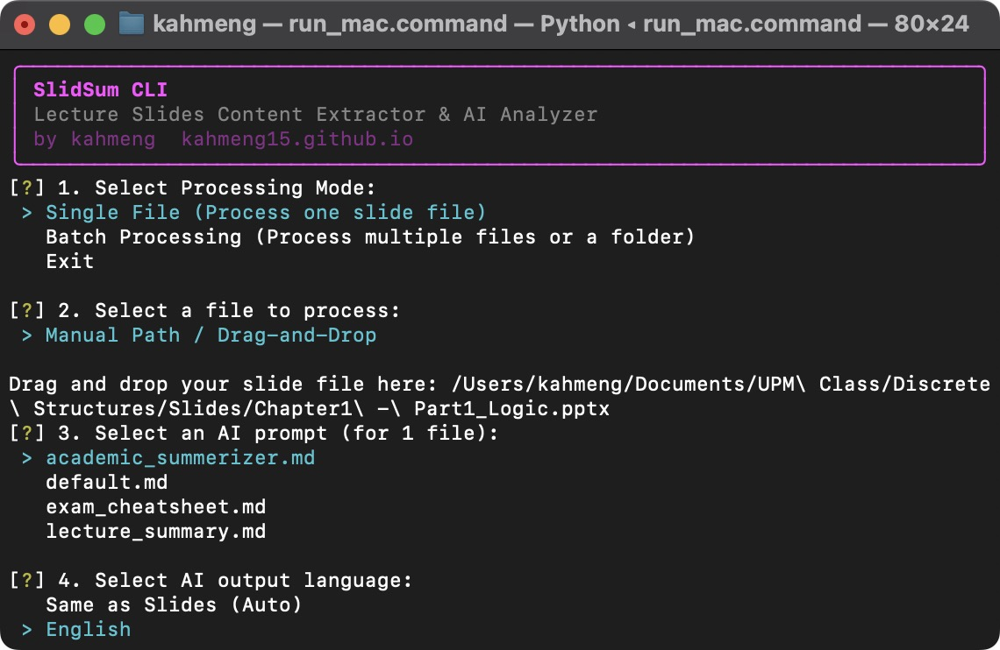

# SlidSum


### AI-Powered Lecture Slides Analyzer
**by kahmeng [kahmeng15.github.io](https://kahmeng15.github.io)**

SlidSum is a powerful, interactive CLI tool designed for extracting structured content from lecture slides. It reads slide files (PDF, PPTX, or images), extracts their content, and uses AI (Gemini or OpenAI) to generate customizable summaries, notes, or analyses — all guided by your own prompt templates.

---

## 🚀 Key Features

- **Multi-format Support:** PDF, PPTX/PPT, PNG, JPG/JPEG — all handled seamlessly.
- **AI Vision:** Image-only slides (scanned PDFs, images) are sent to the AI as visual context for deeper analysis.
- **Customizable Prompts:** Drop any `.md` prompt into the `prompts/` folder; SlidSum auto-detects them at startup.
- **Batch Processing:** Drag-and-drop support for multiple files or entire folders directly into the terminal.
- **Multiple AI Providers:** Gemini (default) or OpenAI, with automatic model fallback for reliability.
- **Output Language:** Auto-detect, English, or Malay (Bahasa Melayu) — choose your preferred output language.
- **Idle Auto-quit:** Automatically exits after a configurable idle period to save RAM.
- **Cross-Platform:** macOS / Linux / Windows launchers included for quick access.

---

## 📋 Prerequisites

1. **Python 3.9+:** Ensure you have a modern version of Python installed.
2. **API Keys:** You'll need at least one of the following:
   - [Google Gemini](https://aistudio.google.com/) (recommended, default provider)
   - [OpenAI](https://platform.openai.com/)

### Windows — First-time Setup (recommended for new users)

If you're new to Windows, follow these quick setup steps to install Git, Python, and package managers.

- **Install Git:**
  - winget (recommended):
    ```powershell
    winget install --id Git.Git -e
    ```
  - Chocolatey:
    ```powershell
    choco install git
    ```
  - Manual: Download from https://git-scm.com/download/win

- **Install Python 3.9+ (required):**
  - winget:
    ```powershell
    winget install --id Python.Python.3 -e
    ```
  - Chocolatey:
    ```powershell
    choco install python
    ```
  - Manual: https://www.python.org/downloads/windows/
  - Verify in a new terminal:
    ```powershell
    python --version
    pip --version
    ```

- **Package Managers:**
  - `winget` is included on recent Windows 10/11 builds and is recommended for first-time setup. If you prefer Chocolatey, follow https://chocolatey.org/install to install it first.

- **Create & activate the virtual environment:**
  ```powershell
  python -m venv .venv
  .venv\Scripts\activate
  ```

- **PowerShell Tips:**
  - If PowerShell blocks scripts, run as Administrator and enable: `Set-ExecutionPolicy -ExecutionPolicy RemoteSigned -Scope CurrentUser`
  - Alternatively, use `cmd` (Command Prompt) to avoid execution policy issues.

---

## 🛠️ Installation

1. **Clone the Repository:**
   ```bash
   git clone https://github.com/kahmeng15/slidsum
   cd slidsum
   ```

2. **Create a Virtual Environment:**
   ```bash
   python3 -m venv .venv
   source .venv/bin/activate  # Windows: .venv\Scripts\activate
   ```

3. **Install Dependencies:**
   ```bash
   pip install -r requirements.txt
   ```

---

## ⚙️ Configuration

1. **Create your `.env` file:**
   ```bash
   cp .env.template .env
   ```

2. **Fill in your API Keys:**
   - `GEMINI_API_KEY` or `OPENAI_API_KEY`: Depending on your preferred AI provider.
   - `SUMMARIZER_PROVIDER`: Set to `gemini` (default) or `openai`.

3. **Fine-tune Settings (Optional):**

| Variable | Default | Description |
|---|---|---|
| `INPUT_DIR` | `./input_slides` | Folder SlidSum watches for slide files |
| `OUTPUT_DIR` | `./output_files` | Where outputs are saved |
| `PROMPTS_DIR` | `./prompts` | Folder containing prompt `.md` files |
| `FILE_PATTERN` | `*.pdf,*.pptx,*.ppt,*.png,*.jpg,*.jpeg` | Slide file types to detect |
| `GEMINI_MODELS` | `gemini-2.0-flash` | Comma-separated model list (first = primary) |
| `OPENAI_MODELS` | `gpt-4o-mini` | Comma-separated model list |
| `MAX_IMAGE_DIM` | `1600` | Max pixel dimension for images sent to AI |
| `IDLE_TIMEOUT` | `300` | Seconds of inactivity before auto-quit (0 = off) |

---

## 🕹️ Usage

### Quick Start (Single Command)
You can launch the application instantly using the provided scripts (they auto-activate the environment):
- **macOS:** Double-click `run_mac.command` in Finder (or run `./run_mac.command` in terminal).
- **Linux:** `./run_linux.sh`
- **Windows:** Double-click `run_win.bat`

### Manual Run
If you prefer running it manually, you must activate your environment first:
```bash
# macOS / Linux
source .venv/bin/activate
python slidsum.py

# Windows
.venv\Scripts\activate
python slidsum.py
```

### Processing Modes

- **Single File Mode:** Select a file from your `input_slides` folder or drag-and-drop a specific file path.
- **Batch Processing Mode:**
  - **Select Multiple:** Pick several files from your input folder using a checkbox list.
  - **Collection Mode:** Drag and drop multiple files/folders one by one. Type `d` when your queue is ready.

### Processing Options

- **Slide Extraction:** Always generates `slides_content.md` with raw extracted text.
- **AI Post-processing:** Choose from your Markdown prompts in the `prompts/` folder and select your target output language (English, Malay, or Auto).

---

## 📂 Project Structure

- `input_slides/`: Place your slide files here for quick selection.
- `output_files/`: Transcriptions and AI summaries are organized here by filename.
- `prompts/`: Add your own `.md` files here to create custom AI post-processing behaviors.
- `temp/`: Temporary processing files (automatically cleared on exit).

### Prompt System

Place any `.md` file in the `prompts/` folder. SlidSum auto-detects them at startup.

**Included prompts:**
- `default.md` — Structured lecture summary (concepts, definitions, examples)
- `lecture_summary.md` — Lossless, comprehensive slide content extraction

**Writing your own:** The prompt file is sent as the system instruction to the AI. The extracted slide content is appended automatically. Build your own prompts to customize output format and content focus.

### How It Works

```
Input File (PDF / PPTX / Image)
        │
        ▼
┌─────────────────────────────┐
│  extract_slides_content()   │  PyMuPDF / python-pptx / Pillow
│  → slides_content.md        │  (text per page + images for AI vision)
└─────────────────────────────┘
        │
        ▼  (if AI prompt selected)
┌─────────────────────────────┐
│     analyze_slides()        │  Gemini / OpenAI (multimodal)
│  → {prompt_name}.md         │
└─────────────────────────────┘
        │
        ▼
output_files/{filename}/
  ├── slides_content.md     ← raw extracted text
  └── {prompt_name}.md      ← AI-generated analysis
```

---

## 📜 License

This project is licensed under the MIT License - see the [LICENSE](LICENSE) file for details.
